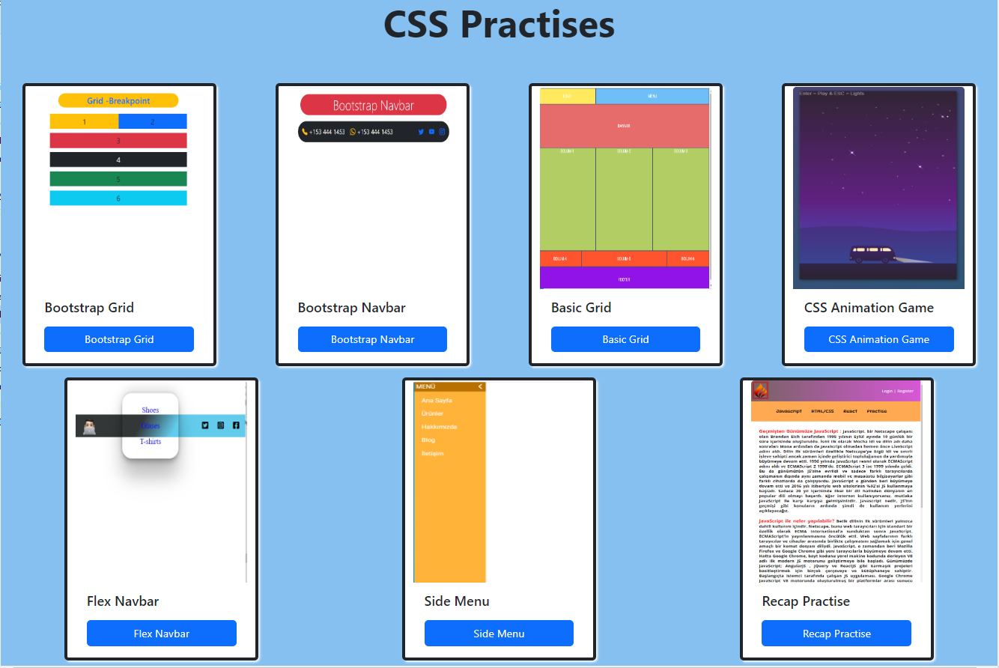

# Project : CSS Practises

## Check The Live Website ➡️ [Live Website](https://skycooper.github.io/CSS-Practice/)

## Animation of the Website

## Visualization of the Website

## Description

Practises abaout CSS skills
## Project Skeleton 

|----CSS Practises

        |----Bootstrap Grid
        |----Bootstrap Navbar
        |----Basic Grid
        |----CSS Animation Game
        |----Flex Navbar
        |----Side Menu
        |----Recap Practise
        |----images
        |----index.html
        |----style.css
        |----readme.md 

### Overview
I mastered CSSfeatures in these projects. You can see the visual representation of the websites above.
